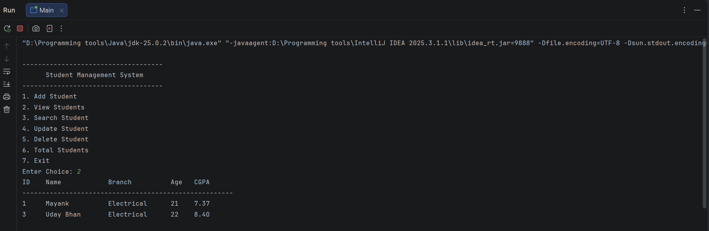

# 🎓 Student Management System


A console-based Student Management System developed using Java, JDBC, and MySQL.
---

## 📑 Table of Contents

- ✨ [Features](#-features)
- 🛠 [Technologies Used](#-technologies-used)
- 📂 [Project Structure](#-project-structure)
- 🗄 [Database Setup](#-database-setup)
- ▶️ [How to Run the Project](#-how-to-run-the-project)
- 🖥 [Program Preview](#-program-preview)
- 📚 [Learning Outcomes](#-learning-outcomes)
- 👤 [Author](#-author)


## ✨ Features

* ➕ Add a new student
* 📋 View all students
* 🔍 Search student by ID
* ✏️ Update student details
* ❌ Delete student record
* 📊 Display total number of students

---

## 🛠 Technologies Used

* **Java**
* **JDBC (Java Database Connectivity)**
* **MySQL**
* **IntelliJ IDEA**

---

## 📂 Project Structure

```
Student-Management-System
│
├── src
│   ├── app
│   │     └── Main.java
│   │
│   ├── dao
│   │     └── StudentDAO.java
│   │
│   ├── db
│   │     └── DBConnection.java
│   │
│   └── model
│         └── Student.java
│
├── README.md
└── .gitignore
```

---

## 🗄 Database Setup

Create a database in MySQL:

```sql
CREATE DATABASE studentdb;
USE studentdb;

CREATE TABLE students (
    id INT PRIMARY KEY AUTO_INCREMENT,
    name VARCHAR(100),
    branch VARCHAR(50),
    age INT,
    cgpa FLOAT
);
```

---

## ▶️ How to Run the Project

1. Clone the repository

```
git clone https://github.com/your-username/student-management-system.git
```

2. Open the project in **IntelliJ IDEA**

3. Configure MySQL connection in `DBConnection.java`

4. Run

```
Main.java
```

---
## Program Preview




## 📌 Learning Outcomes

This project demonstrates:

* Java **Object-Oriented Programming**
* **JDBC database connectivity**
* **DAO design pattern**
* **CRUD operations**
* Structured project architecture

---

## 👤 Author

**Mayank Singh**
